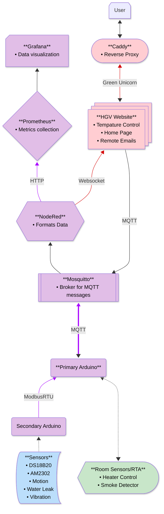

# HGV Project REMS006 
A folder of all the code created during my time working at on the HGV Project. All the code is organize into folders with README in each explaning what each file does. 

Most of the code here is either just for testing hardware with only a few file being used in the final Arduino Code. All Docker Container should already be running on REMS006 so there isn't a need to reinstall them. asdfasd

The Main files for the Project Can be found in Primary and Secondarys Folders. Backup Docker Compose files and Conf can be found in the Docker Folder.
## Features

- RS485 Communications via ModbusRTU
- Module Sensor Addition 
- MQTT Messaging 
- NodeRed Setup
- Prometheus + Grafana


## Tech Used
All Items are link to Either the Main Page of the Item or Useful Resources

**Hardware:** 
[RS485](www.circuitstate.com/tutorials/what-is-rs-485-how-to-use-max485-with-arduino-for-reliable-long-distance-serial-communication/), 
Ethernet Port, 
(All The Sensors) 

**Arduino Library:** 
[SPI](https://docs.arduino.cc/learn/communication/spi/), 
[Ethernet](https://docs.arduino.cc/libraries/ethernet/), 
[ModbusRTUMaster](https://github.com/CMB27/ModbusRTUMaster), [ModbusRTUSlave](https://github.com/CMB27/ModbusRTUSlave), [PubSubClient](https://github.com/knolleary/pubsubclient), 
[ArduinoJson](https://arduinojson.org/), 
(All the Sensor Library)

**Docker Container:** 
[Mosquitto](https://github.com/sukesh-ak/setup-mosquitto-with-docker), 
[NodeRed](https://nodered.org/), 
[Prometheus](https://prometheus.io/), 
[Grafana](https://grafana.com/)

### Other
Some extra tools and resources That I used and could be helpful 
- [Circuitstate Doc on Modbus Communication](https://www.circuitstate.com/tutorials/what-is-modbus-communication-protocol-and-how-to-implement-modbus-rtu-with-arduino/)
- [Arduino Community Edition Plug-in](https://marketplace.visualstudio.com/items?itemName=vscode-arduino.vscode-arduino-community) 
## Installation
### Local
To Download all the Code Locally Open a Terminal and cd into a directory you wish to Download all of this  

```bash
  git clone https://github.com/TriforceGB/rems006-Arduino.git
```

### On REMS006
most if not all of this Repo should already be download onto rems006 but if not then your can run the command above or if it just not updated then you can run 

```bash
  git pull
```
in the folder or use the .sh command that should be already on REMS006 and just cancel befrore it start to upload to the Arduino 
## Things Left to Work on

- A Working RS485 Conntion

- Adding RTA/Home Intergartion (Changing Tempature)

- Adding Abilty to Read Primary Sensors (Smoke)


## Related Repository
Here are some Repo from other students that work on the HGV at the Sametime I did

[Arham's REMS005](https://github.com/HammyTheWammy/rems005)

[Zoya's REMS007](https://github.com/ElectricCornstarch/rems007)

[Abbas's REMS008](https://github.com/abbashaider1444/rems008)

[HGV Website](https://github.com/TriforceGB/HGV-Webapp)

[Custom .sh Shortcuts](https://github.com/TriforceGB/custom.sh-shortcuts)


## Project Flow Chart
A Guide to the Rest of the HGV Project, Each Colour Shows what REMS Computers Each Node is Running/Being Working on


| Computers     | Colour        |
| ------------- |:-------------:|
| REMS005       | Blue          |
| REMS006       | Purple        |
| REMS007       | Red           |
| REMS008       | Green         |
 


## About Maintaining This Repository
After 2025-01-22 I personally will not Be working on or maintaining this repository but anyone else working on the HVG Project can take from this repository. If you do have any major issue with the main code you can reach out and I do my best to help with anything found in this Repo.  
