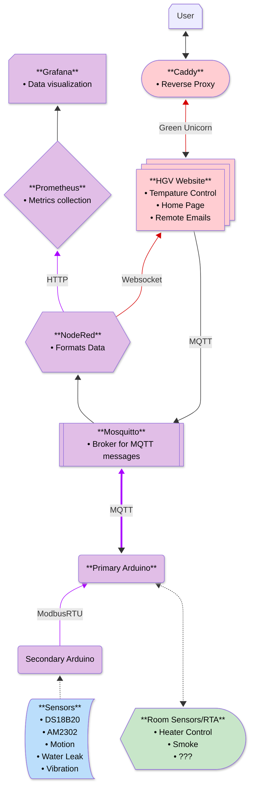

# HGV Project REMS006 

## Features

- Light/dark mode toggle
- Live previews
- Fullscreen mode
- Cross platform


## Tech Stack

**Client:** React, Redux, TailwindCSS

**Server:** Node, Express


## Installation

Install my-project with npm

```bash
  npm install my-project
  cd my-project
```
    
## FAQ

#### Question 1

Answer 1

#### Question 2

Answer 2


## Screenshots


## Roadmap

- Additional browser support

- Add more integrations


## Related Repository
Here are some Repo from Other Students that work on the HGV at the Same Time I did

[Arham's REMS005](https://github.com/HammyTheWammy/rems005)

[Zoya's REMS007](https://github.com/ElectricCornstarch/rems007)

[Abbas's REMS008](https://github.com/abbashaider1444/rems008)

[HGV Website](https://github.com/TriforceGB/HGV-Webapp)

[Custom .sh Shortcuts](https://github.com/TriforceGB/custom.sh-shortcuts)

## Project Flow Chart
A Guide to the Rest of the HGV Project, Each Colour Shows what REMS Computers Each Node is Running/Being Working on
 


## About Maintaining This Repository
After 2025-01-22 I personally will not Be working on or maintaining this repository but anyone else working on the HVG Project can take from this repository. If you do have any major issue with the main code you can reach out and I do my best to help with anything found in this Repo.  
